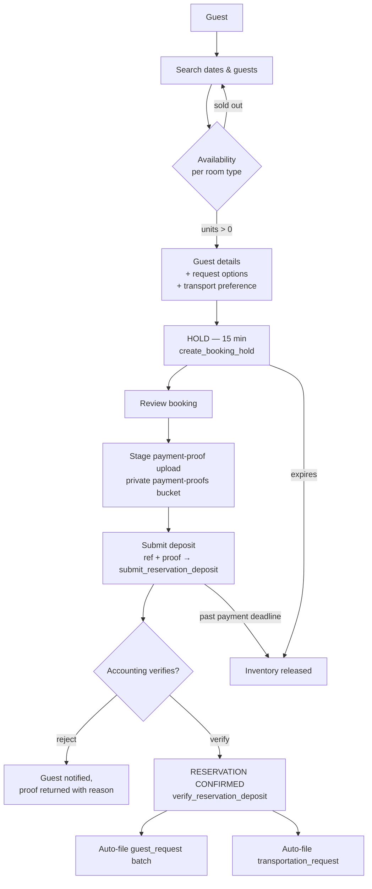
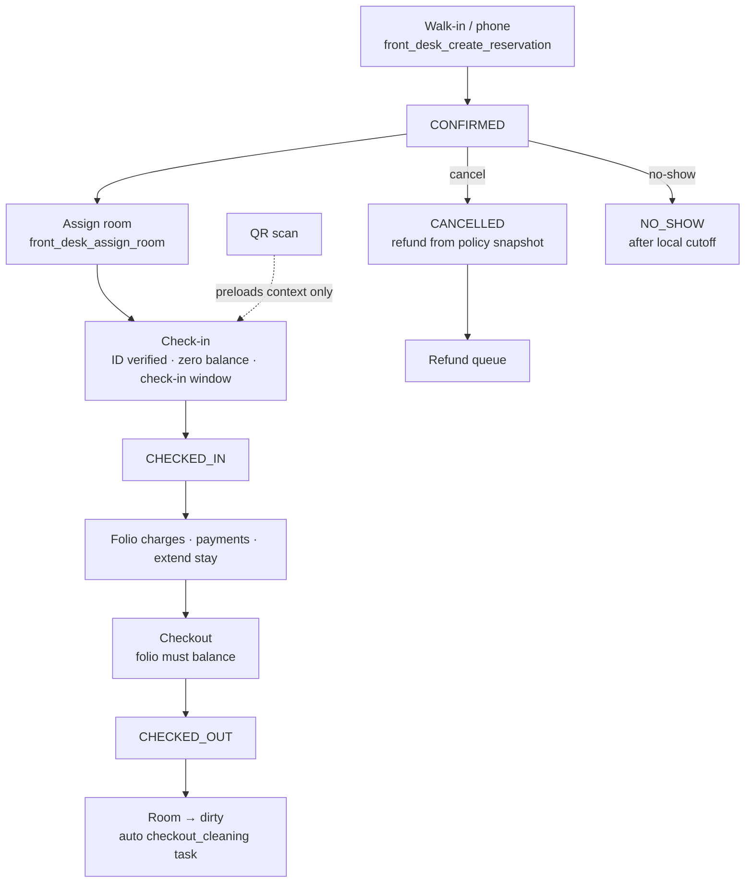
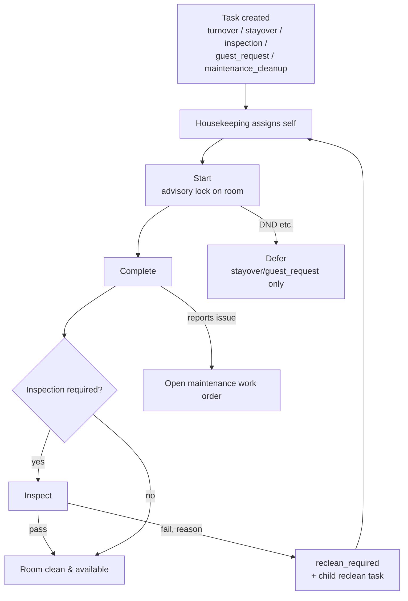
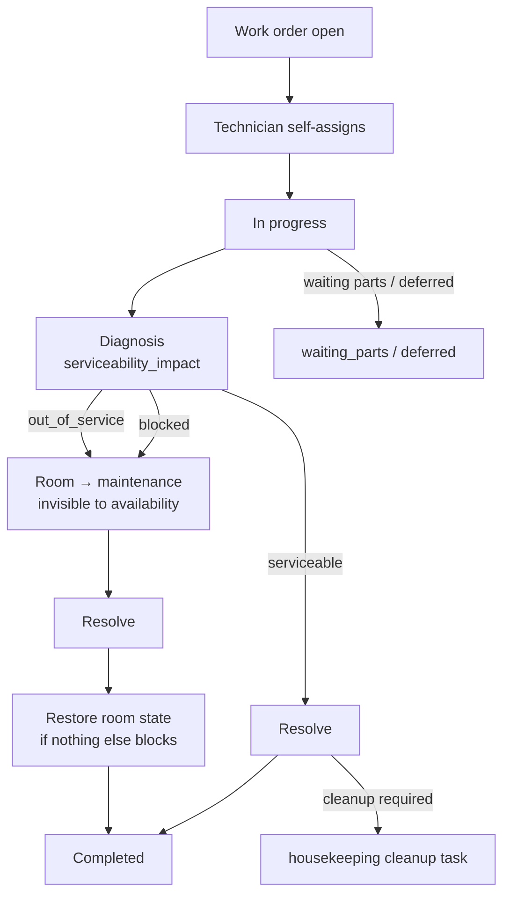
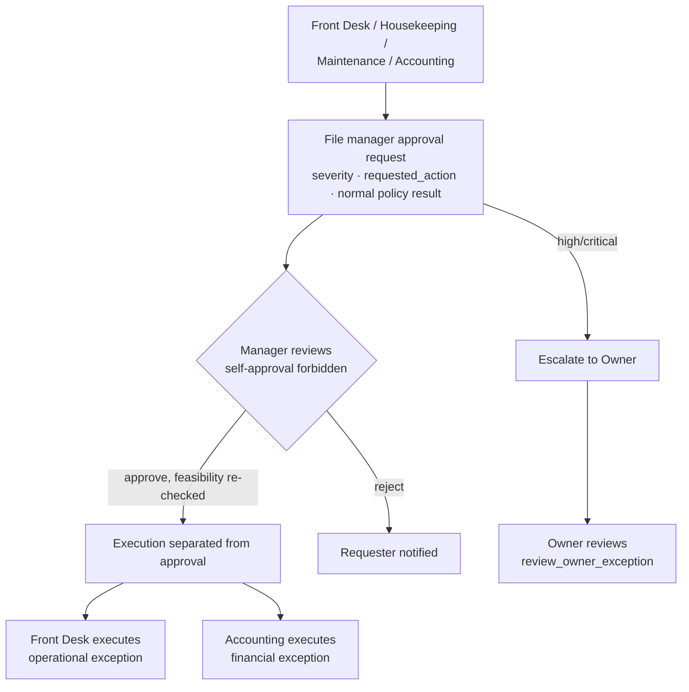
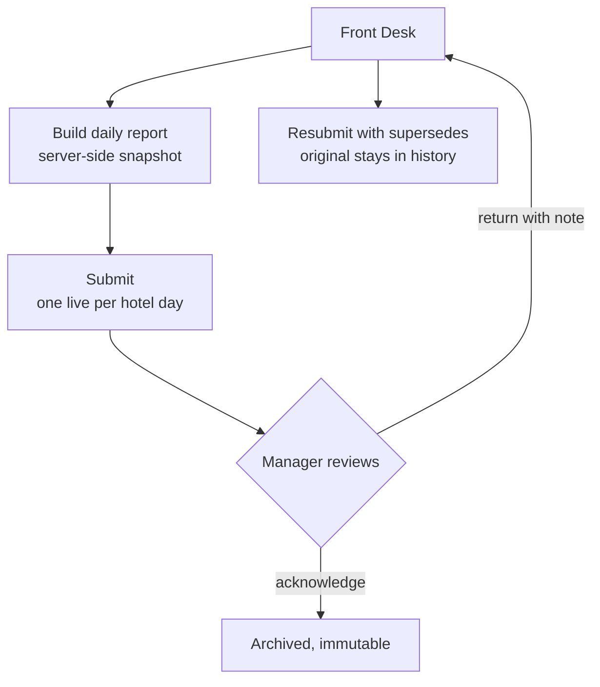

# HAVEN — System Diagrams (BPA · ERD · Use Case · WBS)

> Standard analysis diagrams of the implemented system, as Mermaid. `SYSTEM.md` remains
> the authoritative reference; if a diagram disagrees with it or the code, they win.
> Last refreshed: 2026-09-09.

## 1. Business Process Architecture (BPA)

How the hotel's business actually runs inside HAVEN, per process lane. The connective
tissue: a checkout makes a room dirty and opens a housekeeping task; a maintenance
diagnosis can block a room from sale; an Accounting-verified deposit confirms a website
booking; a confirmed booking files its guest-request batch and transportation request.

### 1.1 Guest booking (the money path)

### 1.2 Reservation lifecycle (front desk spine)

### 1.3 Housekeeping loop

### 1.4 Maintenance loop

### 1.5 Exception engine (manager approvals)

### 1.6 Daily operations report

## 2. Entity Relationship Diagram (ERD)

Core operational tables (~30 of the ~45 live tables; audit/innovation support tables
compressed). Money is `numeric(12,2)` PHP; most entities are text-prefixed ids
(`GST-`, `RM-`, `RSV-`, `HKT-`, `MWO-`, `INV-`).

```mermaid
erDiagram
    user_accounts ||--o{ guests : "links guest users"
    user_accounts ||--o{ staff : "mirrors staff accounts"

    room_types ||--o{ rooms : "typed by"
    rooms ||--o{ reservation_room_assignments : "assigned"
    room_types ||--o{ reservations : "booked as"
    reservations ||--o{ reservation_room_assignments : "for"
    reservations ||--o{ booking_holds : "converted from"
    reservations ||--o{ reservation_change_requests : "has"
    reservations ||--|| invoices : "billed on"
    reservations ||--o{ guest_requests : "carries"
    reservations ||--o| transportation_requests : "one active"

    guests ||--o{ reservations : "stays of"
    reservations ||--o{ housekeeping_tasks : "triggers"
    rooms ||--o{ housekeeping_tasks : "cleans"
    rooms ||--o{ maintenance_orders : "serviced by"
    maintenance_orders ||--o{ maintenance_order_events : "logs"
    guest_request_catalog ||--o{ guest_requests : "typed by"

    invoices ||--o{ folio_charges : "itemizes"
    invoices ||--o{ payments : "settled by"
    reservations ||--o{ payments : "paid for"
    reservations ||--o{ refund_requests : "refunded via"
    refund_requests ||--o{ refund_attempts : "attempted"
    payments ||--o{ payment_reconciliations : "compared"
    user_accounts ||--o{ cash_shifts : "opens"
    invoices ||--o{ financial_documents : "snapshots"
    folio_charges ||--o{ financial_adjustments : "corrected by"

    reservations ||--o{ manager_approval_requests : "exceptions for"
    user_accounts ||--o{ front_desk_reports : "submits"
    front_desk_reports ||--o{ front_desk_reports : "supersedes"
    user_accounts ||--o{ notifications : "receives"
    user_accounts ||--o{ audit_logs : "actor of"
    reservations ||--o{ qr_tokens : "check-in token"
    rooms ||--o{ qr_tokens : "placard token"
    user_accounts ||--o{ manager_notes : "writes"

    transport_vehicle_types ||--o{ transportation_requests : "priced by"

    user_accounts {
        text id PK
        text email
        text role "owner/admin/manager/front_desk/housekeeping/maintenance/accounting/guest"
        boolean active
        int auth_version
        boolean recovery_required
    }
    room_types {
        text name PK
        numeric base_rate "behind propose→approve"
        jsonb photo_urls
        boolean active
    }
    rooms {
        text id PK
        text number UK
        text type FK
        text status "available/reserved/occupied/dirty/maintenance"
        text housekeeping "dirty/cleaning/clean/inspection/reclean_required"
        boolean administratively_active
        int configuration_version
    }
    reservations {
        text id PK
        text status "pending/confirmed/checked_in/checked_out/cancelled/no_show"
        text guest_id FK
        text room_type FK
        text room_number "denormalized"
        numeric total_amount
        jsonb operational_policy_snapshot
        jsonb deposit_policy_snapshot
        jsonb request_options
        jsonb transportation_preferences
        text source "website/front_desk"
    }
    booking_holds {
        uuid token PK
        text room_type
        numeric total
        timestamptz expires_at "15 min"
        text status "active/payment_submitted/converted/expired"
    }
    reservation_room_assignments {
        uuid id PK
        text room_id FK
        text reservation_id FK
        daterange stay "GiST exclusion: one active per room"
    }
    housekeeping_tasks {
        text id PK
        text room_number
        text reservation_id FK
        text task_type "checkout_cleaning/stayover_cleaning/inspection/…"
        text status "pending/assigned/in_progress/completed/deferred/cancelled"
    }
    maintenance_orders {
        text id PK
        text room_number
        text status "open/assigned/in_progress/resolved/completed/…"
        text serviceability_impact "serviceable/blocked/out_of_service"
    }
    guest_requests {
        uuid id PK
        text reservation_id FK
        uuid batch_id "one decision per batch"
        text approval_status "pending/approved/rejected"
        text department
        text priority
    }
    guest_request_catalog {
        uuid id PK
        text request_type
        text department
        boolean active
    }
    transportation_requests {
        uuid id PK
        text reservation_id FK
        text service_type "pickup/dropoff/round_trip"
        text status "REQUESTED/REVIEWED/SCHEDULED/ASSIGNED/IN_PROGRESS/COMPLETED/CANCELLED/REJECTED"
        numeric fare_amount "posted at assign"
        int version "optimistic"
    }
    transport_vehicle_types {
        uuid id PK
        int seats
        numeric base_fare
        numeric booking_fee
    }
    invoices {
        text id PK
        text reservation_id FK
        numeric balance "derived: sync_invoice_financials"
    }
    folio_charges {
        uuid id PK
        text invoice_id FK
        text purpose "room/extension/transport/…"
        numeric amount
    }
    payments {
        uuid id PK
        text invoice_id FK
        text reservation_id FK
        text purpose "deposit/stay/refund"
        text status "pending/verified/settled"
        text payment_method "bank_transfer/gcash"
        text proof_storage_path "private bucket"
        numeric amount
    }
    refund_requests {
        uuid id PK
        text reservation_id FK
        numeric amount
        text status
    }
    cash_shifts {
        uuid id PK
        text staff_user_id FK "one open shift per staff"
        numeric counted_total
        numeric variance
    }
    manager_approval_requests {
        uuid id PK
        text reservation_id FK
        text requested_action
        text approval_status
        text execution_status
        text authority_level "manager/owner"
        int version
    }
    front_desk_reports {
        uuid id PK
        date report_date UK "one live per hotel day"
        jsonb snapshot "immutable"
        uuid supersedes FK
        text status "submitted/acknowledged/returned"
    }
    hotel_operational_policies {
        text id PK "single 'default' row"
        text timezone "owner-only edit"
        int version
    }
    notifications {
        uuid id PK
        uuid user_id FK
        text event_type
        timestamptz read_at
    }
    audit_logs {
        bigint id PK
        text actor_user_id FK
        text action
        jsonb before_data
        jsonb after_data
    }
    financial_documents {
        uuid id PK
        text document_number "RCP-/FOL-"
        jsonb snapshot "never updated"
    }
```

*(Omitted for legibility: `account_recovery_tokens`, `housekeeping_task_assignments`,
`maintenance_order_assignments`, `payment_reconciliations` fields, `financial_adjustments`
fields, `manager_notes` fields, `inventory`, `vendors`, `purchase_orders`,
`inventory_movements`, `analytics_model_runs`, `analytics_predictions`, `ai_interactions`,
`qr_scan_events` — all real tables, none of them change the core picture. See SYSTEM.md §9.)*

## 3. Use Case Diagram

Mermaid has no native UML use-case shape, so this is a flowchart styled as one: actors on
the left/right, the system boundary as a subgraph, use cases as rounded nodes grouped by
module.

```mermaid
flowchart LR
    Guest([Guest])
    FD([Front Desk])
    ACC([Accounting])
    HK([Housekeeping])
    MNT([Maintenance])
    MGR([Manager])
    OWN([Owner])
    ADM([Admin])

    subgraph HAVEN[HAVEN Hotel Management System]
        subgraph Booking[Guest Booking]
            UC1([Browse catalogue & search rooms])
            UC2([Book: hold · deposit · proof upload])
            UC3([Register account / recover password])
        end
        subgraph Self[Self-Service Portal]
            UC4([Cancel / change reservation])
            UC5([Submit guest-request batch])
            UC6([Request transportation])
            UC7([Submit stay-payment proof])
            UC8([View notifications & receipts])
        end
        subgraph FrontOps[Front Desk Operations]
            UC9([Create walk-in / phone reservation])
            UC10([Assign room / change room / extend stay])
            UC11([Check-in guest — includes ID verification])
            UC12([Checkout guest — requires balanced folio])
            UC13([Post charges / record payments])
            UC14([Review guest-request batch])
            UC15([Operate transportation queue])
            UC16([Submit daily operations report])
            UC17([Scan QR — check-in / room ops])
        end
        subgraph Housekeep[Housekeeping]
            UC18([Assign · start · complete task])
            UC19([Inspect room — pass / fail reclean])
            UC20([Defer task / report maintenance issue])
        end
        subgraph Maint[Maintenance]
            UC21([Work-order lifecycle & diagnosis])
        end
        subgraph Money[Accounting]
            UC22([Verify / reject deposits & stay payments])
            UC23([Process refunds / adjustments / reversals])
            UC24([Cash shifts · reconciliation · documents])
            UC25([Execute financial approvals])
        end
        subgraph Gov[Manager · Owner · Admin Governance]
            UC26([Review / execute manager approvals])
            UC27([Escalate exception to Owner])
            UC28([Owner exception review])
            UC29([Admin: accounts · roles · recovery · policies])
            UC30([Catalog & rate proposals: room types, photos, vehicles])
            UC31([Review daily reports · Staff & Duty])
        end
        subgraph Innov[Innovation Layer]
            UC32([Predictive insights: occupancy · workload · inventory · risk])
            UC33([Ask HAVEN / daily brief / explain — advisory AI])
            UC34([QR operations placards])
        end
    end

    Guest --> UC1 & UC2 & UC3 & UC4 & UC5 & UC6 & UC7 & UC8
    Guest -.->|displays check-in QR| UC17

    FD --> UC9 & UC10 & UC11 & UC12 & UC13 & UC14 & UC15 & UC16 & UC17
    FD -.->|files requests| UC26

    ACC --> UC22 & UC23 & UC24 & UC25

    HK --> UC18 & UC19 & UC20
    HK -.->|scans room QR| UC17

    MNT --> UC21
    MNT -.->|scans room QR| UC17

    MGR --> UC26 & UC27 & UC30 & UC31 & UC32 & UC33 & UC34

    OWN --> UC28 & UC30 & UC32

    ADM --> UC29 & UC30
```

Key <<include>>/<<extend>> semantics drawn from the business rules: **Check-in** includes
*identity verification* and requires a *zero balance*; **Checkout** requires a *balanced
folio* and extends into the *housekeeping turnover task*; **Book** optionally extends with
*transportation preference* and *guest-request options*; **Scan QR** always re-checks
identity, role and current resource state — it bypasses nothing.

## 4. Work Breakdown Structure (WBS)

Breakdown of the delivered system (what was actually built, matching SYSTEM.md's surfaces
and the 51-migration schema).

```mermaid
flowchart TD
    WBS[HAVEN Hotel Management System]

    WBS --> A[1 Foundation]
    A --> A1[Next.js App Router + TypeScript]
    A --> A2[Supabase / Postgres + 51 migrations]
    A --> A3[Environment & dual-mode data layer]
    A --> A4[Deploy: Vercel + daily analytics cron]

    WBS --> B[2 Identity & RBAC]
    B --> B1[NextAuth credentials + JWT revalidation]
    B --> B2[8 roles · capability map]
    B --> B3[Staff accounts, recovery tokens]
    B --> B4[Two-layer enforcement: route + RPC guards]

    WBS --> C[3 Rooms & Catalog]
    C --> C1[Room types, photos, amenities]
    C --> C2[Physical room roster & governance]
    C --> C3[Rate propose→approve workflow]
    C --> C4[Transfer vehicle types]

    WBS --> D[4 Guest Booking Flow]
    D --> D1[Search & server-side availability]
    D --> D2[15-min holds + policy snapshots]
    D --> D3[Deposit + payment-proof upload]
    D --> D4[Confirmation & auto-filing]

    WBS --> E[5 Self-Service Portal]
    E --> E1[Reservations, cancel & change requests]
    E --> E2[Guest-request batches]
    E --> E3[Transportation requests]
    E --> E4[Stay payments, receipts, notifications]

    WBS --> F[6 Front Desk Operations]
    F --> F1[Walk-in creation, assign, check-in, checkout]
    F --> F2[Folios, charges, payments, cash shifts]
    F --> F3[Daily operations report]
    F --> F4[QR check-in & room scanning]

    WBS --> G[7 Housekeeping]
    G --> G1[Task lifecycle + queue]
    G --> G2[Inspection & reclean cycle]
    G --> G3[Room readiness state]

    WBS --> H[8 Maintenance]
    H --> H1[Work-order lifecycle]
    H --> H2[Serviceability & room blocking]

    WBS --> I[9 Guest Requests]
    I --> I1[Request type catalogue]
    I --> I2[Batch approval routing]

    WBS --> J[10 Transportation]
    J --> J1[Request lifecycle REQUESTED→COMPLETED]
    J --> J2[Fare posting to folio]

    WBS --> K[11 Accounting]
    K --> K1[Deposit & payment verification]
    K --> K2[Refunds, adjustments, reversals]
    K --> K3[Reconciliation & documents]

    WBS --> L[12 Governance]
    L --> L1[Manager approvals & escalation]
    L --> L2[Owner exception review]
    L --> L3[Admin accounts, policies, rooms]

    WBS --> M[13 Innovation Layer]
    M --> M1[Predictive analytics engine]
    M --> M2[Advisory Gemini AI]
    M --> M3[QR operations tokens]

    WBS --> N[14 Quality Assurance]
    N --> N1[54-file vitest suite]
    N --> N2[Live rollback-safe system test]
    N --> N3[Security hardening & audit trail]
```

