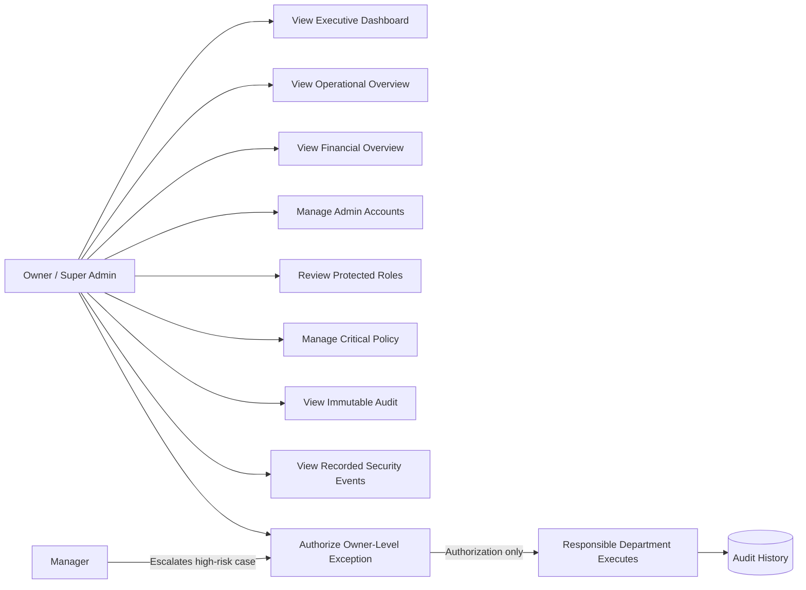

# HAVEN — Owner / Super Admin Implementation Report

Current model: **PROVISIONAL OWNER / SUPER ADMIN GOVERNANCE BASELINE**

## 1. Existing system audit

HAVEN already had one `owner` role in `user_accounts`, fixed code-owned permissions, Admin governance RPCs, JWT role propagation, `auth_version`, secure recovery, immutable `audit_logs`, operational policy snapshots, Manager approvals, Accounting ledgers, and specialist Front Desk/Housekeeping/Maintenance workflows. Owner was routed through the operational staff dashboard and inherited almost every mutation.

A read-only live audit found 14 accounts: two Owner records with one active, and one inactive Admin. The architecture therefore supports one-or-more Owners while protecting the last active Owner; it does not enforce exactly one Owner.

## 2. Gap analysis

| Issue | Severity | Impact | Action |
|---|---|---|---|
| Owner inherited routine departmental mutations | Critical | Governance role could perform check-in, repair, room care, refunds, and reconciliation | Removed Owner from execution helpers and route guards |
| Owner used operational dashboard | High | Executive oversight and routine work were conflated | Added dedicated Owner dashboard and API |
| No Owner-level escalation state | High | High-risk Manager cases had no explicit executive authorization | Extended Manager approvals with Owner authority level |
| Generic CRUD allowed Owner writes | Critical | Could bypass protected domain workflows | Generic POST/PATCH now reject Owner |
| Executive reporting incomplete | High | No unified real-data financial/operational/governance view | Added live executive summaries and drilldowns |
| Documentation described Owner/Admin as operational super-users | High | RBAC documentation contradicted safe business ownership | Corrected architecture and booking docs |
| No failed-login telemetry | Medium | Cannot truthfully show brute-force/security analytics | Deferred; UI shows only recorded events |
| No fresh reauthentication primitive | Medium | Critical actions cannot require recent password proof | Deferred rather than adding UI-only security |

## 3. Owner use cases

Implemented: executive dashboard, cross-department operational summary, executive financial summary, governance/security summary, Admin account creation/lifecycle/recovery, protected-role catalogue review, critical policy change, high-level audit, actual security events, department performance/risk, trends, Manager-to-Owner exception review, and authorization/rejection with department execution.

## 4. Use-case diagram / documentation

No editable Owner diagram existed, so this document is the authoritative Owner use-case representation rather than a conflicting duplicate.

Owner is intentionally not connected to routine check-in, checkout, cleaning, repair resolution, payment verification, refund processing, or reconciliation.

## 5. Authority hierarchy

Owner governs the business/system at executive level. Admin performs routine application administration. Manager supervises daily operations and Manager-level exceptions. Front Desk, Housekeeping, Maintenance, and Accounting execute specialized workflows and remain responsible for their domain truth.

## 6. Owner protection

The existing Admin governance migration blocks Admin changes to Owner/Admin targets, Owner self-deactivation, self-role change, and removal/demotion of the last active Owner. Owner sessions are database-revalidated. The implementation preserves multiple-Owner support and does not add a destructive uniqueness constraint.

## 7. Admin governance

Owner can create an inactive, recovery-required Admin without a default password; initiate one-time secure recovery; and activate, deactivate, or suspend Admin accounts with reason and optimistic version. Admin cannot govern Owner or another Admin.

## 8. RBAC

Owner has broad read visibility and dedicated governance authority. Owner cannot manage reservations, verify deposits, collect/post payments, process refunds, adjust folios, operate shifts, issue financial documents, review Manager-level cases, request Manager approval, execute approved department actions, coordinate routine operations, or complete Housekeeping/Maintenance work.

## 9. Executive dashboard

The dashboard displays live occupancy, serviceable/available/blocked rooms, overdue Housekeeping, critical Maintenance, unresolved Guest Service escalations, active/inactive staff, security warnings, pending Owner exceptions, revenue, refunds, balances, department queue summaries, seven-day occupancy/collection trends, and recent immutable audit records.

## 10. Financial oversight

Owner uses the existing authoritative Accounting ledger in read-only mode. Metrics derive from settled payments, refunds, invoices, shifts, and reconciliations. Accounting remains the only role that processes refunds, adjustments, reconciliation, and related corrections.

## 11. Operational oversight

Owner receives read-only Front Desk, Housekeeping, Maintenance, Guest Service, Accounting, and Manager summaries plus high-risk drilldowns. No duplicate operational tables or task managers were created.

## 12. Owner exception workflow

A Manager may escalate a pending high/critical Manager approval to Owner with a reason and current version. Owner revalidates and authorizes or rejects it. The existing workflow then requires Front Desk or Accounting to execute the approved action. Owner review never calls a department execution RPC.

## 13. Policy authority

Owner can update high-risk hotel policy, including timezone, through the existing versioned Admin policy workflow. Validity checks and audit remain server-side. Updates affect future transactions only.

## 14. Security recovery

Owner can initiate secure Admin recovery through the existing random-token architecture. Only the SHA-256 token digest is stored; links expire and are one-time; passwords are bcrypt hashes. Self-recovery/ownership succession is deferred because no independent trusted recovery provider exists.

## 15. Audit

Owner receives broad read-only audit visibility. Manager escalation and Owner authorization/rejection create distinct events. The existing database trigger continues to reject application updates or deletes to audit history.

## 16. Session security

Account role, active state, recovery state, and `auth_version` are refreshed through NextAuth JWT callbacks. Admin lifecycle, role, metadata, and recovery actions increment the version and invalidate stale authority. Owner API guards additionally query the active database account on every request.

## 17. Database changes

`20260902010000_owner_executive_governance.sql` additively extends `manager_approval_requests` with authority/escalation/review metadata, an Owner review guard, and two service-role-only RPCs. It does not delete, rewrite, reseed, or reinterpret operational, financial, user, or audit history.

## 18. API / RPC / server changes

Added `GET /api/owner/data`, `POST /api/manager/approvals/:id/escalate-owner`, and `POST /api/owner/exceptions/:id/review`; added `guardOwner`; extended Manager approval projections; routed Owner away from the operational dashboard; blocked Owner generic writes and direct departmental mutations.

## 19. UI changes

Added a responsive themed Owner shell with Executive Overview, Executive Operations, Financial Overview, Departments, Admin Governance, Roles & Permissions, Critical Policies, Owner Exceptions, System Audit, Security Events, and Executive Reports. Manager approval UI now exposes “Escalate to Owner” only for high/critical cases.

## 20. Tests

Focused Owner tests: 12. Cross-role and full regression tests: 289 total. Passed: 289. Failed: 0.

## 21. Quality gates

- `npm test`: passed, 289 tests.
- `npm run typecheck`: passed during implementation; final gate repeated before handoff.
- `npm run lint`: final gate repeated before handoff.
- `npm run build`: final gate repeated before handoff.

## 22. Files changed

Owner-specific additions: `lib/owner-route.ts`, `app/api/owner/data/route.ts`, `app/api/owner/exceptions/[id]/review/route.ts`, `app/api/manager/approvals/[id]/escalate-owner/route.ts`, `components/owner/owner-dashboard-client.tsx`, `lib/owner-governance.test.ts`, and `20260902010000_owner_executive_governance.sql`. Shared RBAC, routing, Manager approval UI/read model, CSS, tests, and architecture docs were updated to enforce the boundary.

## 23. Commits

No commit was created. Existing uncommitted Admin and Maintenance work was preserved.

## 24. Provisional assumptions

One-or-more Owners are permitted because the live system contains two Owner records and the existing governance protects the last active Owner. Owner is executive/governance authority rather than a routine operator. High/critical Manager cases may be escalated; ordinary cases remain at Manager level.

## 25. Deferred features

Ownership transfer/succession, Owner self-recovery, fresh-password reauthentication, configurable exception thresholds, advanced security telemetry, and advanced executive analytics are deferred until product policy or an external trusted security channel exists.

## 26. Known issues

Current security events are audit-derived; failed login attempts are not stored. No external email/SMS identity provider delivers recovery links. Existing legacy SQL RPC bodies still mention Owner operational roles, but their execute privilege is restricted to server service-role and every reachable application mutation route rejects Owner.

## 27. Deployment impact

Supabase requires the pending Maintenance, Admin, and Owner migrations in order. Vercel requires a normal application redeploy after database migration. No new environment variable is required. Existing roles and data remain intact. Migration should precede the application deploy because Owner APIs select new columns.

## 28. Final status

**COMPLETE WITH DEFERRED ITEMS** — core Owner protection, Admin governance, RBAC separation, session security, audit immutability, executive reporting, policy authority, and authorization-versus-execution are implemented. Deferred items require product/security decisions rather than unsafe assumptions.