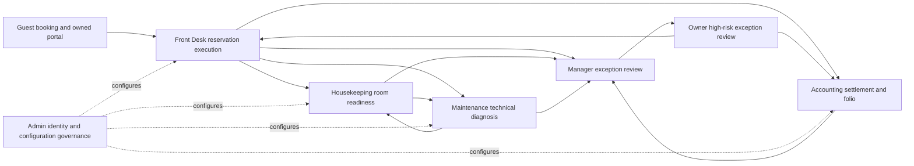

# System Integration

Authoritative cross-role map for the integrated HAVEN workflow. Module-specific details remain in the linked architecture notes; this page defines the boundaries between them.

## End-to-end operational flow

## Single-source records

- Reservations and half-open room assignments are the stay and physical-allocation authority.
- Invoices, immutable settled payments, folio charges, adjustments, refunds, and cash shifts are the financial authority.
- Housekeeping tasks own cleaning/checklist/inspection state.
- Maintenance work orders own diagnosis and serviceability impact.
- `rooms.administratively_active` is the administrative availability switch; operational status, Housekeeping state, and Maintenance serviceability remain separate.
- Manager approvals authorize exceptions; the owning department executes them. Owner reviews only escalated Owner-level exceptions.
- Audit logs are immutable evidence. Dashboard notifications are derived alerts, not a second workflow store.

## Role boundaries

| Role | May execute | Must not execute |
|---|---|---|
| Owner | Owner-level exception authorization and protected governance | Routine departmental or Manager work |
| Admin | Accounts, roles, room metadata/types, future policy | Hotel operations or financial execution |
| Manager | Coordination and Manager-level approvals | Front Desk, Housekeeping, Maintenance, or Accounting execution |
| Front Desk | Reservation, guest, assignment, arrival/departure workflows | Technical, cleaning, or accounting-only actions |
| Housekeeping | Task assignment, cleaning, checklist, inspection, maintenance report | Maintenance diagnosis or reservation execution |
| Maintenance | Work-order assignment, diagnosis, serviceability, repair lifecycle | Housekeeping inspection or financial work |
| Accounting | Settlement, folio correction, refund, shift, reconciliation, document workflows | Reservation and room operations |
| Guest | Owned booking, reservation, profile, request, and payment-submission workflows | Any other customer or staff record |

## Cross-module invariants

- JWT authority is invalid when its `auth_version` differs from the database, or when the account is inactive or recovery-required. Password changes increment the version and force a new sign-in.
- Sellability requires an active room type, an administratively active physical room, no blocking/out-of-service Maintenance diagnosis, and same-day Housekeeping cleanliness.
- Physical assignment additionally requires an available, clean room and a conflict-free half-open assignment window.
- Hotel calendar decisions use the reservation/policy snapshot timezone through `hotel_today`.
- Customer reads and mutations are ownership-scoped. Disabled sessions receive no customer fallback authority.
- All privileged RPC and table access remains server-side and service-role-only; each RPC rechecks the supplied actor's active database role.
- Financial settlement is append-only/idempotent, critical workflow rows use locks or optimistic versions, and audit history is immutable.

## Deployment note

`20260903010000_system_integration_hardening.sql` is the pending definition-only hardening migration. It requires review and explicit remote application before the matching application changes are deployed. It contains no destructive data operation or reseed.

Related: [[Auth & Permissions]], [[API Routes]], [[Customer Portal]], [[Maintenance Operations]], [[Admin Governance]], [[Owner Governance]], [[../03 Reference/Data Model|Data Model]].